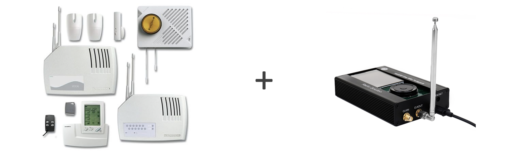
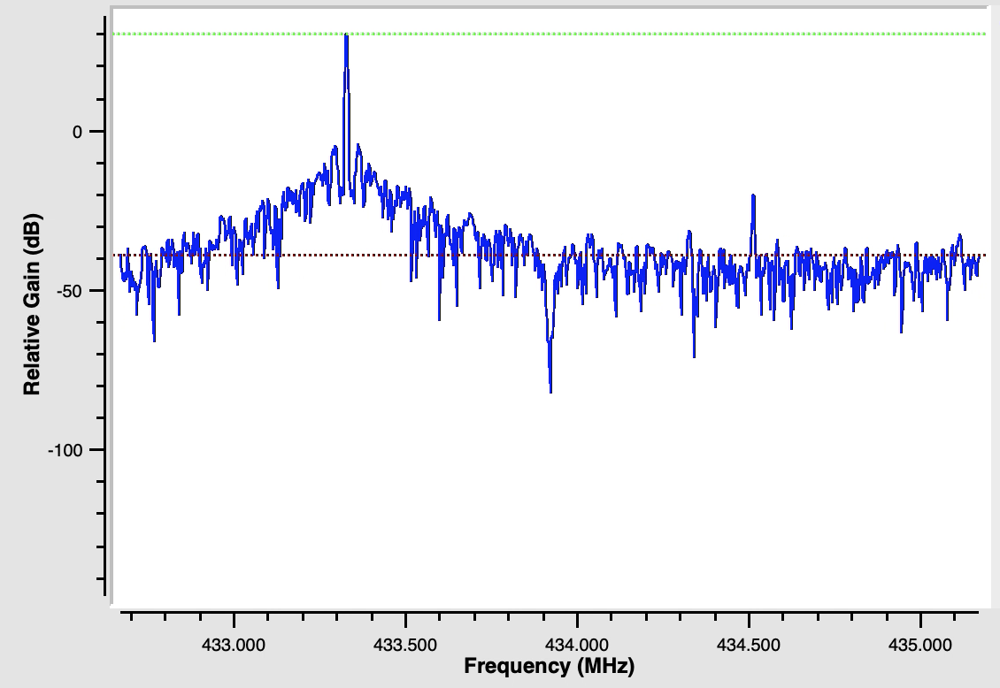
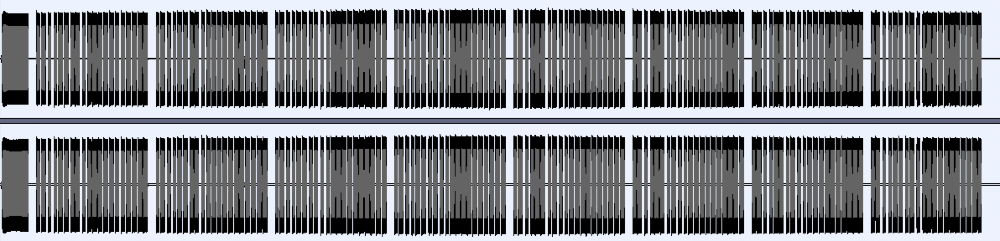
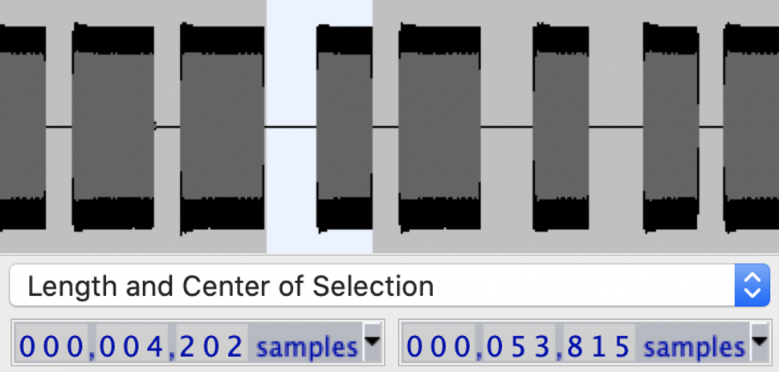
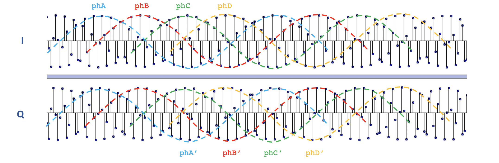
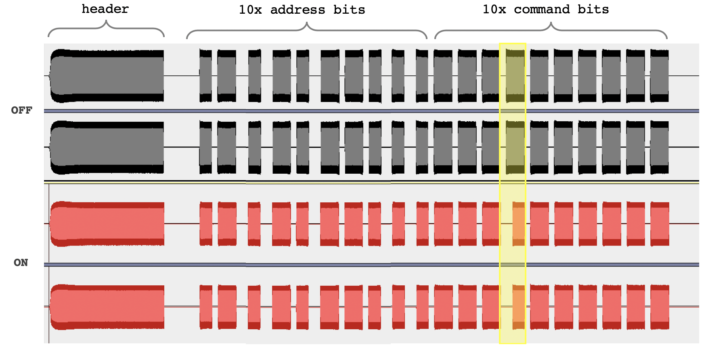

# Alarm control protocol analysis

## ⚖️ Disclaimer ⚖️

> The purpose of the following details and explanations is NOT to promote neither piracy or larceny, or to discredit the alarm manufacturer. Instead, we'll focus on the major flaws of such a system and how it could be designed differently and fixed.

The manufacturer is the French leader in wireless alarm systems. The alarm itself can be setup easily by yourself, with a bit of configuration behind.



## Technology

The alarm itself has two antennas to prevent RF-signal jamming, listening on both 433Mhz / 434Mhz frequencies. Each remote needs to be paired with the central receiver by settings the bits configuration (yup, spoiler alert, code is user-defined... only).

## Modulation analysis

Let's use the HackRF with a regular ANT500 antenna, or any piece of metal with a length of 34.6 cm (433 MHz half-wave)

Let's press the disable-alarm button of one of the remotes we have and record the signal waveform:

```bash
hackrf_transfer -r alarm-off.bin -f 433920000 -s 2500000 -a 1 -l 8 -g 16
```

Like we've done in the [Remote control analysis](remote-control.md) page, let's analyse the FFT-shape of the signal with GNU Radio Companion.



Let's keep in mind both 0.6 MHz (left and right) frequency peaks.

Now we'll observe the signal in the time domain with Audacity:

> import Raw Data > Signed 8-bit PCM, little endian, stereo (for both I and Q channels)



We can clearly notice the header, followed by 8 groups of bits. Let's zoom into one of them:


Well, this looks like a simple **OOK** (*On-Off Keying*) modulation with 20 bits that contains the alarm receiver "unique" address, and the order (alarm enable / disable / trigger alarm manually...). 1 and 0 bits are defined by the pulse width.

*Ok but if we use OOK, we should see only one frequency peak, not two as indicated before?*

**Quick answer:** The HackRF is far away from being perfect, plus process the signal throught quadrature, which creates the mirror part of the frequency peak.

**Real valid answer:** [FFT showing 2 signals - GNU Radio](https://ham.stackexchange.com/a/12435)

A nice thing to setup is to configure Audacity to display the sample length for the current selection. The default indications will display the selection in seconds / milliseconds (according to the defined project rate in Hz) but since we can't set the rate above 250kHz, the information will be inexact. Thanks to the samples count measurement, we can translate this into real timing later:

```js
duration_sec = samples_count * 1 / sample_rate // where sample_rate is the frequency used in the hackrf_transfer, 2.5 MHz or 2500000 Hz
```

Each symbol has the same timing (pause / pulse), let's measure it:



This gives us around 4200 samples, or 1.68 ms per symbol (600 symbols per second).

Ok now let's zoom a bit more to observe the symbol modulation frequency with a bit of highlight on the sin curves:



We can notice that:

- Both I and Q are equals at the same moment, meaning that there's no phase shift. That's a good thing, data is only modulated in **OOK**, nor something like **BPSK** (*Binary Phase Shift Keying*).

- Modulation frequency is generated from 4 sin curves, each one shifted about `2𝜋/4`

- About 78 samples defines one sin period, which means a frequency of **32kHz**

## Protocol analysis

Let's repeat all these steps with another key of the alarm remote:

```
hackrf_transfer -r alarm-on.bin -f 433920000 -s 2500000 -a 1 -l 8 -g 16
```

Import the data into Audacity as another stero track, just under the previous one we got, and compare both signals



(**Note:** use the CTRL/CMD + K key combinaison to crop the offset of the signal, because we need both stereo tracks to be synchronised)

The manufacturer website indicates that the address code is set with a combinason of **10 dip-switches**. This gives us the **10 bits address** that we can see above, and that doesn't change, the rest of the payload will be likely the instruction (spot the difference between *enable* and *disable* alarm signals) 

## Protocol flaws & replay attack

As the awesome [Samy Kamkar](https://samy.pl/opensesame/) demonstrated with his *OpenSesame* device, many door bells and garage doors are still using this fixed-address sequence.

However, I was a bit surprised alarm systems will use the same method: I was thinking about something more secure, like the rolling codes used in modern car keys. 

Add the "anti-jamming" double antenna / frequency system (to prevent roll-blocking) and we have a pretty decent system, way more secure than the current one described in this page.

## Generate our own signals

> 👆 If you're thinking about something illegal, please read (again) the disclaimer at the very beginning of this page. 👆

We've seen how to analyse an existing signal, but what about creating our own one? This way, we can iterate over the 1024 possible addresses (`2^10`).

Consider we can skip the 7 last groups of bits sequences (we'll just send the first one, plus the header), we could in theory send up to 20 sequences per second. 

Nice. In less than a minute, we could theoretically brute-force every existing combinaison of address bits and (potentially) disable, or enable any alarm based on this method.

> **Note:** We could apply the De Bruijn algorithm to exploit overlap in the shift registers, but we'll keep this simple for now.

> **Note 2:** I'll use Node.js for the signal generator script, but any language could work there, that's not rocket science.

### Data carrier

As seen before, the data frequency is based on 4 sin signals. Plus, the *I* and *Q* signals are not phase-shifted, which can be created easily with a few lines of code. For the gap between pulses, that even more simple.

```js
function generateGap(buff, nbSamples) {
    buff.push(...new Array(nbSamples * 2 /* I and Q */).fill(0));
}

function generateSinusModulation(buff, nbSamples) {
    const nbWaves = 4;
    const tau = (2 * Math.PI / nbWaves);
    for (i=0;i<nbSamples;i++) {
        // generate n phases alternation signal
        let sin = Math.round(Math.sin(i*DATA_STEP_PER_SAMPLE + (i % nbWaves) * tau) * (HACKRF_AMPLITUDE / 2));
        if (sin > 255) sin = 255;
        buff.push(sin, sin); // I and Q are the same signals
    }
}
```

### Symbols timing

To create all required symbols (header, logic 1 and 0, and gap), we just have to measure the different pulses width as we did before with Audacity.

Check the [generator script file](../assets/code/alarm-generator.js) and complete with your own timing values.

### Generate the 8-bits IQ file

Let's execute our script with the payload we want to send, for example: `10 bits address = 0x000 + 10 bits command = 0x3FF`

```bash
node alarm-generator.js 00000000001111111111 signal.bin
```

### Transmit the signal

Test the signal by sending it to the HackRF with a bit of gain (mind the frequency and the sampling rate):

```bash
hackrf_transfer -t signal.bin -f 433920000 -s 2500000 -a 1 -x 8
```

You should have heard some audio feedback coming from your alarm receiver by now... well done.

### What to do next?

For each bit sequence, we now have to:

1. choose an address (`0...1023`)
2. generate the payload parameter (*address + command*)
3. execute the `alarm-generator.js` script
4. execute the `hackrf_transfer` command

Might be easier to modify the `alarm-generator.js` file to loop over all 1024 address combinaisons, and then use the `child-process` module to execute the `hackrf_transfer` transmit command... 😏
