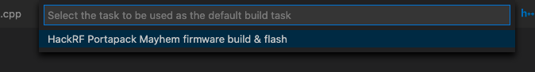

# Portapack Mayhem build instructions

Since the performance is really bad under Docker, let's configure our mac so we can build the firmware directly on it.

**Spoiler alert:** Goes from 8 minutes to 8 seconds compilation time 🕺

## Clean directory

The Docker build will leave pre-compilation steps files (`*.a`, `*.d`, `*.o`) that we don't need.

Clean everything before moving from the Docker procedure to the native one.

```bash
find . -name "*.d" -type f -delete
find . -name "*.o" -type f -delete
find . -name "*.a" -type f -delete

rm -rf build/*
```


## ARM toolchain

Download the `arm-none-eabi-xxx` compilers and likers from the official website (https://developer.arm.com/tools-and-software/open-source-software/developer-tools/gnu-toolchain/gnu-rm) and extract the files into your home directory.

Ensure you have the correct binary files in your directory:

```bash
ls /path/to/your/arm-none.macos64_1.17.0/tools/compiler/bin

# should return a list with...
# arm-none-eabi-cpp
# arm-none-eabi-c++
# arm-none-eabi-g++
# arm-none-eabi-objcopy
# ...
```

Then, add the ARM binary files path to your system (temporary, for the current shell only):

```bash
PATH=$PATH:/path/to/your/arm-none.macos64_1.17.0/tools/compiler/bin
```

## macOS tools

**Homebrew** must be installed on your machine, obviously.

```bash
brew install cmake
brew install ccache
brew install dfu-util
```

## Python 3.x setup

Under macOS, Python 2.7 will be linked to the `/usr/bin/python` instead of the 3.x version (if you have both).

Because the `/usr/bin/python` is protected, even the `sudo rm`won't work, neither the `chattr` or `chflags`.

Quick fix is to modify the Hackrf's firmware script that uses the Python 3 version, `hackrf/firmware/libopencm3/scripts/irq2nvic_h` (from the *libopencm3* project):

*Replace*

```python
#!/usr/bin/env python
```

*With*

```python
#!/usr/bin/env python3
```

**Hey 👋** Don't commit this file, we'll keep the changes on your laptop only.

Finally, if not already installed on your machine, run

```bash
pip3 install pyyaml
```

## Compilation time!

### From scratch:

```bash
cd build
cmake ..
make firmware
```

This might take the same time as with the Docker procedure, don't panick.

### Once the firmware has been built at least once

In the `build` directory:

```bash
make firmware
```

You should see a real difference here 🚀

## Flash it!

Put your HackRF into USB mode, and then, from the `build` directory:

```bash
hackrf_spiflash -w firmware/portapack-h1_h2-mayhem.bin
```

## Bonus: Visual Studio Code integration

Since I tend to build, flash and test each firmware iteration very often *(now I can compile it in less than 10 seconds and that there isn't any time left for coffee breaks)*, the best way to save time is to integrate the Portapack build and flash operations into [Visual Studio Code](https://code.visualstudio.com/) by adding a keyboard shortcut to it.

1. Open **Run Build Tasks** (⌘ + Shift + P)
2. Paste the following JSON configuration file (will be saved as `.vscode/tasks.json`)

```json
{
    "version": "2.0.0",
    "tasks": [
        {
            "label": "HackRF Portapack Mayhem firmware build & flash",
            "type": "shell",
            "command": "cd build && make firmware && hackrf_spiflash -w firmware/portapack-h1_h2-mayhem.bin",
            "problemMatcher": [],
            "group": {
                "kind": "build",
                "isDefault": true
            }
        }
    ]
}
```

3. Set it as default task if it's not already the case



4. Test it using the build task shortcut! (⌘ + Shift + B)

Now, each time you want to run your freshly written code, you don't need to switch window to the terminal, run the build, then flash the firmware... Just use the build shortcut 🤸‍♂️

**Note:** Remember to put your HackRF/Portapack into USB mode before running the command, otherwise the `hackrf_spiflash` command will obviously fail...
