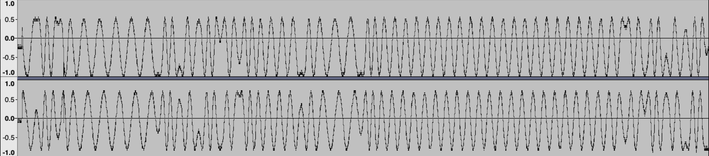
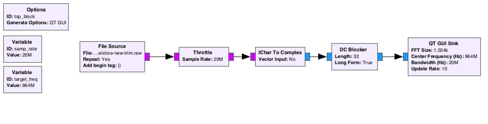
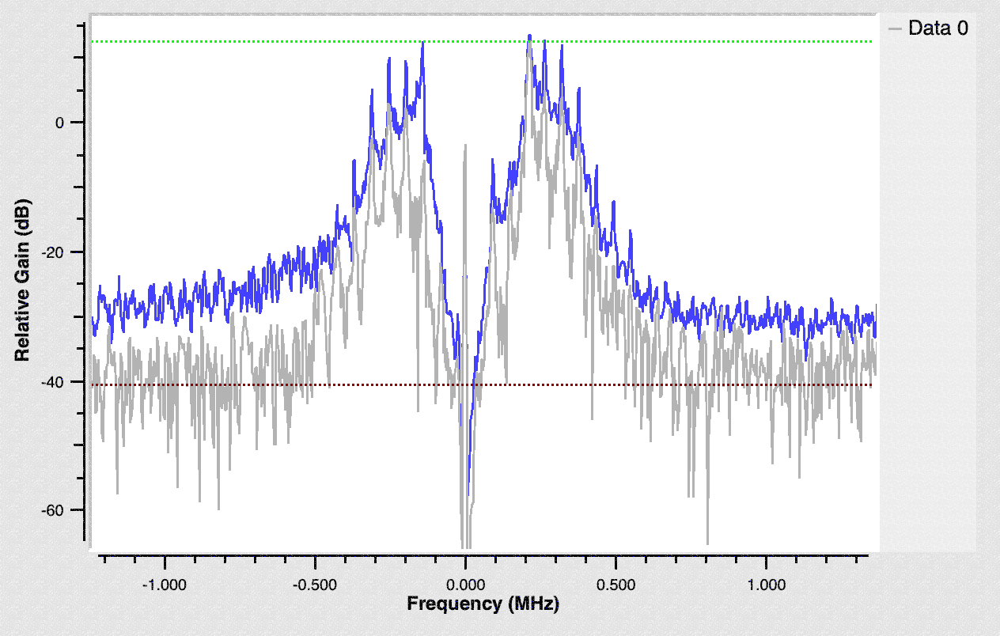
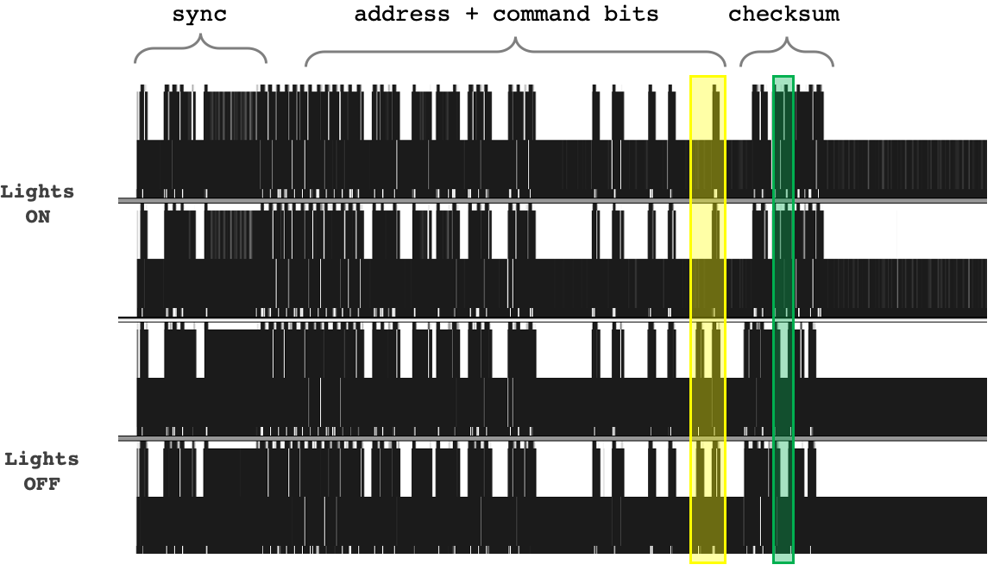
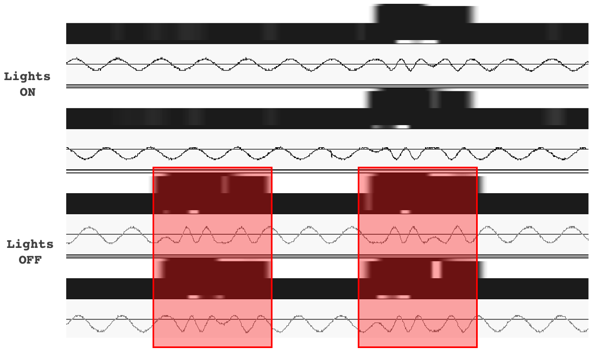
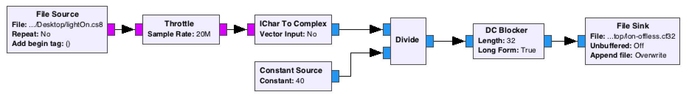
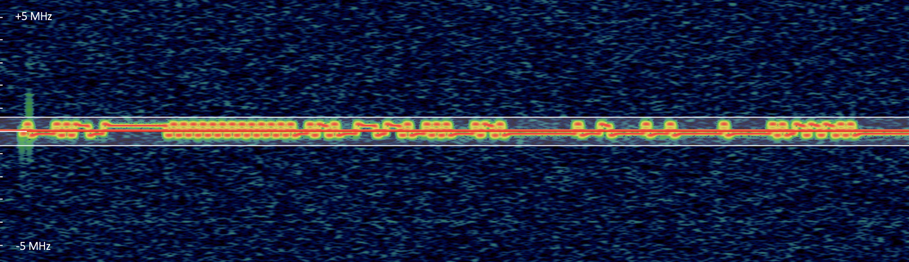
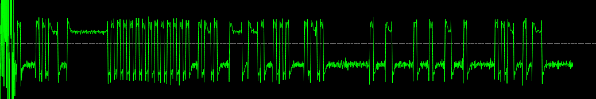
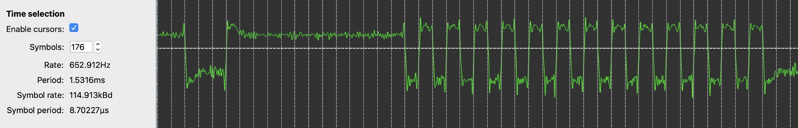

# Remote control analysis

Let's try recording a Schneider Electric store & light remote control.

Sadly the Portapack record feature is limited to 500k samples per second, but we do not have this limitation when using the HackRF in USB mode (up to 20Ms/s).

## Settings

- **Center frequency:** 864MHz (Z-wave)
- **Bandwith:** 20MHz / 20Ms/s
- **Amplifier:** 14dB antenna amp enabled, LNA/IF gain set to 8 dB, baseband gain set to 20 dB

## Receive the data

`remote-extract.raw` file will contains both 8bit I and Q (complex quadrature) signal data in the following order: `IQIQIQIQ...`

**Source**:

https://github.com/mossmann/hackrf/blob/master/host/hackrf-tools/src/hackrf_transfer.c

```c
typedef struct 
{
    char        chunkID[4]; /* 'data' */
    uint32_t    chunkSize; /* Size of data in bytes */
    /* Samples I(8bits) then Q(8bits), I, Q ... */
} t_DataChunk;
```

So, if we record at 20Ms/s during 100ms, we'll have 2 million samples, with 2 bytes per sample (I and Q), so 4MB of data.

```bash
hackrf_transfer -r remote-extract.raw -f 864000000 -s 20000000 -a 1 -l 5 -g 20
```

## Observe the data

We can use Audacity, just set the following settings to analyse the waveforms: 8 bits, signed, 2 channels (I and Q, shifted apart about 90 degrees)

Here what the remote signal looks like in the time domain:



From now, we can assume that the signal has been modulated using:

- B**F**SK, or Binary **Frequency** Shift Keying, https://en.wikipedia.org/wiki/Frequency-shift_keying

- B**P**SK, or Binary **Phase** Shift Keying, https://en.wikipedia.org/wiki/Phase-shift_keying

## GNU Radio Companion

From the extracted raw 8bit file, we can perfom multiple operations in GNU Radio Companion.

First thing to do is to convert the IQ sequence bytes into a real complex value with the `IChar To Complex` bloc.

Next we'll remove the DC offset with the `DC Blocker bloc`, as there is one according to the official HackRF documentation.

> Samples produced by HackRF are measurements of radio waveforms, but the measurement method is prone to a DC bias introduced by HackRF. It's an artifact of the measurement system, not an indication of a received radio signal. DC offset is not unique to HackRF; it is common to all quadrature sampling systems.



This will produce the following FFT graph (centered at 864 MHz):



## Decoding the signal

Let's assume the signal has been encoded using **BFSK**, we'll use the spectrogram (FFT) viewer mode of Audacity.

The settings are the following one (if translated to 44100 Hz sample rate in the software - because Audacity doesn't support 20 MHz)

- **Scale:** Linear
- **Min Frequency:** 300 Hz (translated low frequency is 136 kHz)
- **Max Frequency:** 800 Hz (translated high frequency is 360 kHz)
- **Window:** Hann, 256
- **Colors:** Gain 20 dB, Range 10 dB (Greyscale)

Let's import two recorded signals with this setup, for instance in our case, the light control order, ON and OFF.



With a bit of highlight, we can note:

- an identical leading bits, that can be identified as header / sync bits

- the difference in both what seems to be the command / address of the light to be controlled, and a pack of bits at the end that might be a checksum

- trailing bits (*"0"* symbols, low frequency) 

If we zoom into the difference between the "ON" and "OFF" commands, we spot the signal difference between both waveforms:



**Note:** Frequency is not really stable enought to assume that this is pure BFSK.

Instead, we might have a signal modulated using either BPSK (phase) or BFSK (frequency) with Manchester code (https://en.wikipedia.org/wiki/Manchester_code).

We'll dig into that later...

## Prepare the recorded signals

Since each raw signals IQ data has an offset part, we need to remove it before digging into it. We've done that with Gnu Radio Companion at the beginning of this page, we'll save it as binary files so we can see the real signal waveforms and frequency.

We'll use the following schematic:



**Note:** Remember to set the `repeat` property of the file source to `No` or your output file size will be infine...

**Note 2:** Because the I and Q parts represent a value that is not a real, we'll divide the resulting amplitude by a constant, `40` here, so the range will be between `-1` and `1`.

**Note 3:** GNU Radio Companion works with complex floating-point numbers, so set the output file extension to `*.cf32` (complex floats, 32 bits). **This is important for the next steps.**

## Extract symbols from the signal modulation

Let's use Inspectrum (https://github.com/miek/inspectrum), which is an awesome tool to analyse recorded I/Q signals.

Once the `cf32` output file is opened, you'll see its spectrum analysis along time.



Beautiful isn't it. Add a frequency plot that is in range between the positive and negative frequency (phases).



Awesome. Excepted the first dirty and noisy bursts, it looks like this is pure FSK modulation!

Now add cursors from the first high-frequency symbol till the last one, and adjust the count so each symbol is clearly delimited. Here is a zoom on the first symbols, with the cursors around it:



Let's have a look on what's this signal properties:

- clearly looks like FSK modulation
- there's 176 symbols, which is 22 bytes
- the symbol rate is 114.9 kbps, which is very close to the standard 115.2 kbps speed!

For the next steps, we'll assume the positive frequency represents a `1` symbol, and the negative one a `0` symbol.

We won't translate the frequencies values to symbols by ourself.

### Extract the symbol values from *Inspectrum*:

> Right-click on the frequency plot, Extract symbols > Copy to Clipboard

### Translate into binary symbols

Use Excel or OpenOffice Calc, paste the data, and apply this very simple rule:

```excel
=IF(CELL>0;1;0)
```

Copy the resulting `1` and `0` and convert it using your calculator or an online tool (https://www.rapidtables.com/convert/number/binary-to-hex.html).

**Repeat the process for one or two different remote keys.**

## Extracted binary payload interpretation

Here's what we got from the previous steps for 3 remote keys:

**Lights ON**

```
82B8FFFAAAAAAA 2D0F3A2A0B40004301 080100536D40
```

**Lights OFF**

```
82B8FFFAAAAAAA 2D0F3A2A0B40004301 0811015A3900
```

**Store UP**

```
82B8FFFAAAAAAA 2D0F3A2A0B40004301 086100562700
```

I separated each payload into 3 parts:

- the part that looks loke a header with *sync* symbols (either `0xAA` or `0x55` are used)
- the part that doesn't change (might be the receptor address, group and target)
- the part that changes (arguably the order: on, off, store up...)

---

## Draft part

**To be seen and tested:**

- Manchester code
- Miller code
- PLL
- Costas loop
- URH - FSK?

A very good research paper about BPSK demodulation: https://www2.eecs.berkeley.edu/Pubs/TechRpts/2017/EECS-2017-91.pdf

**Spoler alert:**

- Simple remote uses `mrf-49xa` (FSK) from Microchip and `ATMEGA 328p` from Atmel
- HVAC remote uses `Si4421` (FSK) from Silicon Labs and `ATxmega64D3` from Atmel
